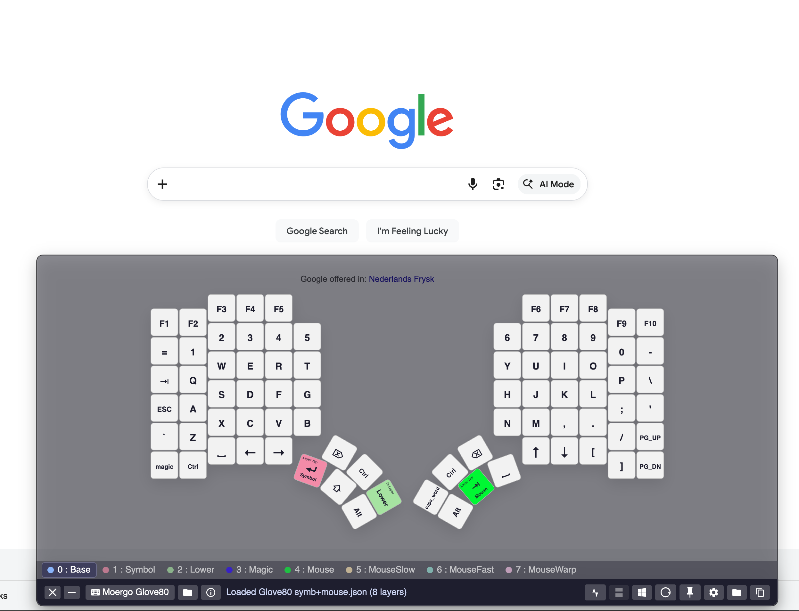
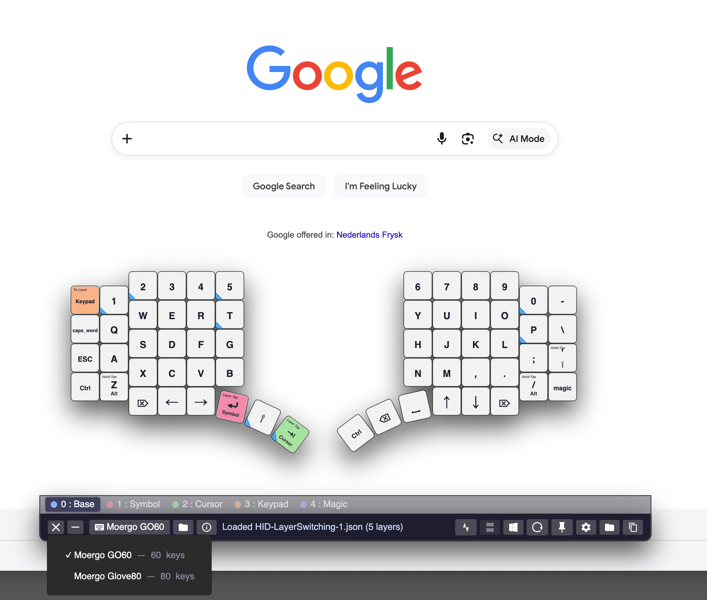
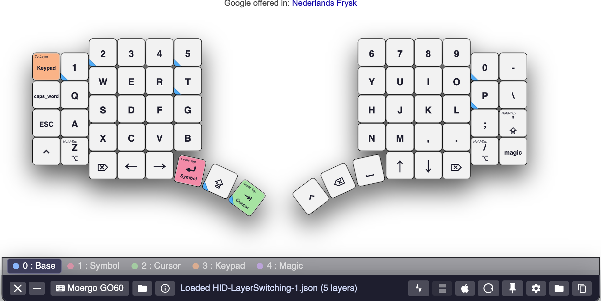
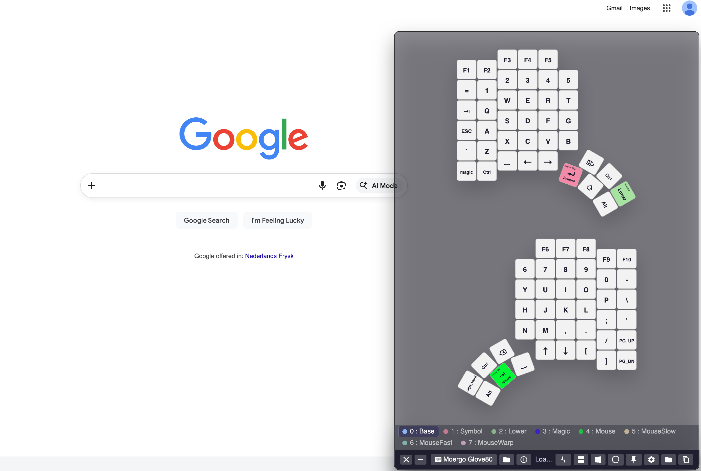
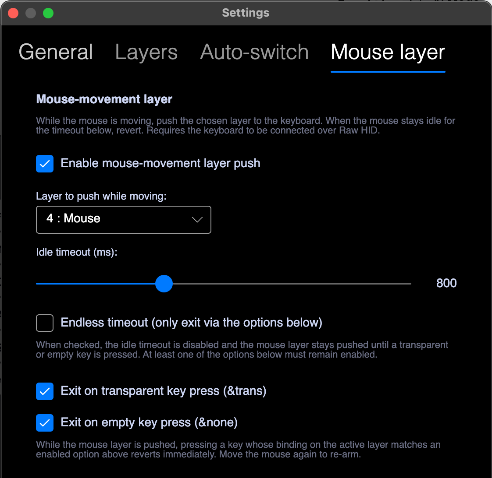
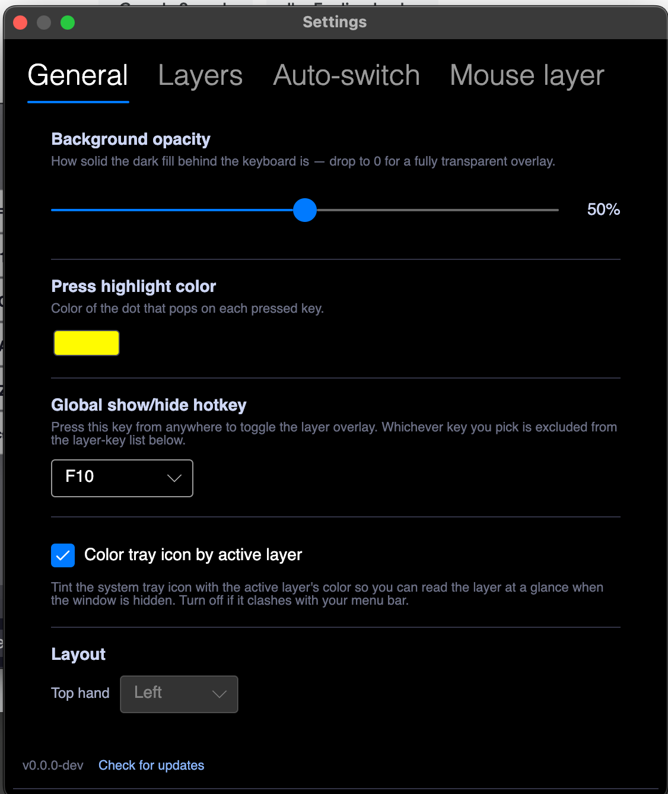
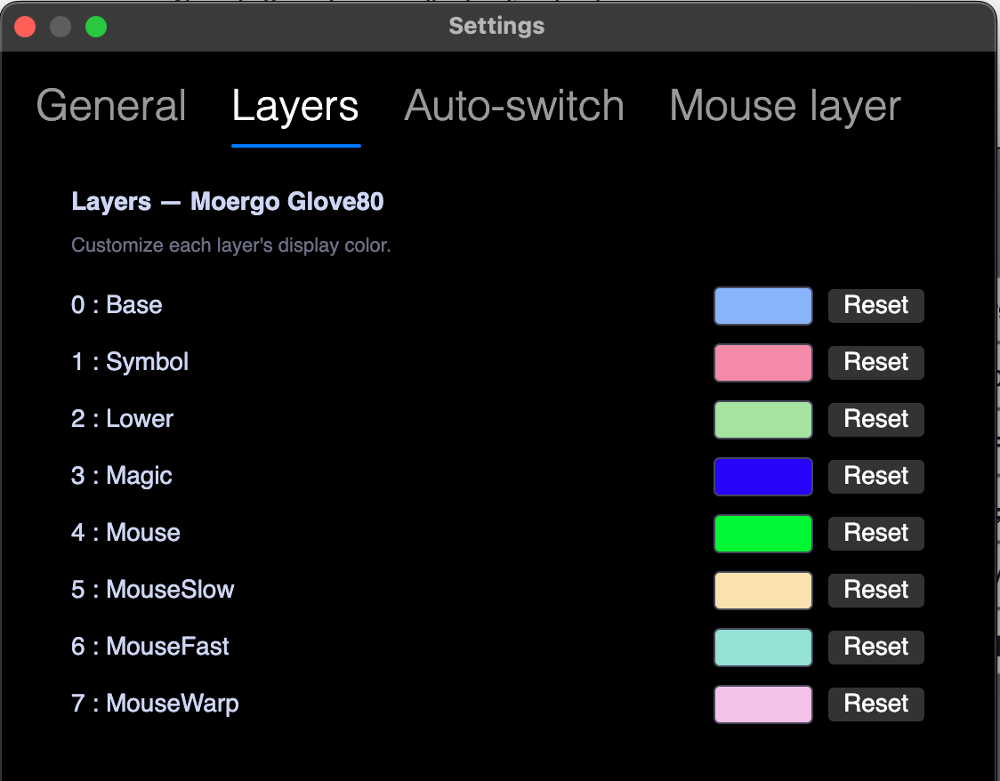
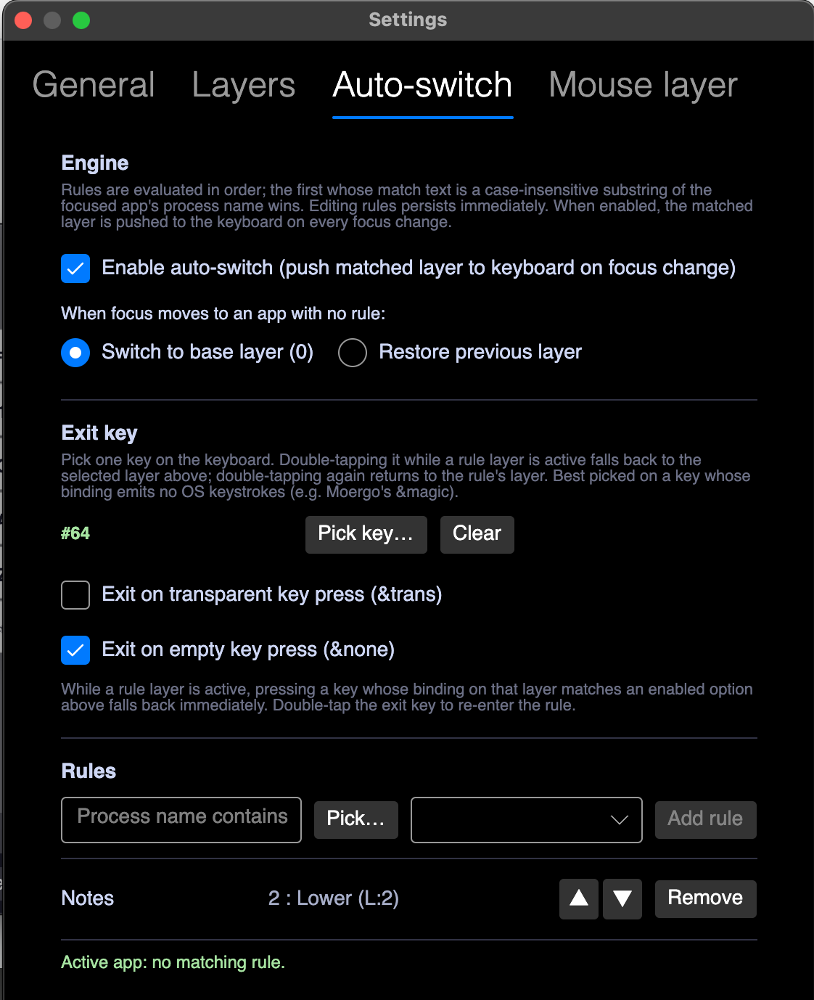
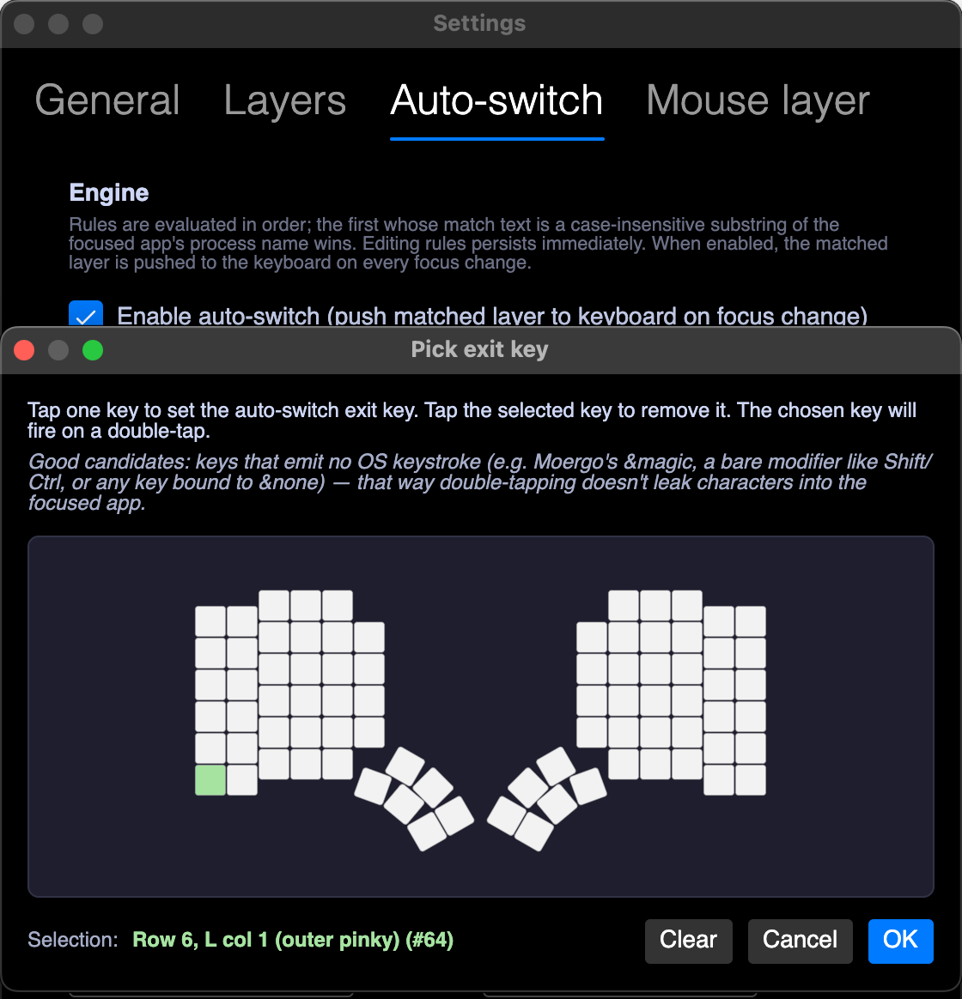

# MoergoLayerViz

Desktop overlay that mirrors the active ZMK layer of a [Moergo](https://www.moergo.com/) GO60 or Glove80 keyboard, in real time, on Windows, macOS, and Linux..

The app reads layout JSON exported from Moergo's online layout editor and renders the keyboard as a small overlay window. When you switch layers on the keyboard, the overlay follows — labels update, the active layer chip lights up, individual keypresses pulse on the board.

No firmware flashing, no keymap editing. The app watches the keyboard via Raw HID — the ZMK firmware reports layer state directly — and optionally pushes layer changes back for the app-focus and mouse-layer features. JSON exports from Moergo's editor drive the visual layout. That's it.



> **Upgrading from v1.x?** v2.0 is HID-only. If your GO60 or Glove80 is running stock firmware (no custom Raw HID build), this release can't track layer state — use the last signal-macro release [v1.2.4](../../releases/tag/v1.2.4) instead, or follow [Firmware support](#firmware-support) to add Raw HID to your board. The [v1.2.4 source tree](../../tree/v1.2.4) still contains the old signal-macro generator, scanner, and `docs/parsing.md` reference for anyone maintaining the v1.x path.

## Install & run

Pre-built zips for each tagged release are on the [latest release](../../releases/latest) page. Each release ships:

- `MoergoLayerViz-<version>-windows-x64.zip` — Windows 10/11, x64.
- `MoergoLayerViz-<version>-macos-arm64.zip` — Apple Silicon Macs (M-series).
- `MoergoLayerViz-<version>-macos-x64.zip` — Intel Macs.
- `MoergoLayerViz-<version>-linux-x64.tar.gz` — Linux, x64 (Raw HID only — see notes).

If you'd rather build it yourself, skip ahead to [Build from source](#build-from-source).

### Windows

1. Download `MoergoLayerViz-<version>-windows-x64.zip` from [Releases](../../releases/latest) and unzip.
2. Run `MoergoLayerViz.App.exe`.

The first launch may show a SmartScreen warning ("Windows protected your PC") because the binary isn't signed by an MS-trusted publisher. Click **More info → Run anyway**. No additional permissions are required.

### macOS

1. Download `MoergoLayerViz-<version>-macos-arm64.zip` (or `-macos-x64.zip` on Intel) from [Releases](../../releases/latest).
2. Extract the zip and move `MoergoLayerViz.app` to `/Applications`.
3. The bundle is ad-hoc signed, so Gatekeeper will block the first launch. Clear the quarantine attribute once:

   ```bash
   xattr -cr /Applications/MoergoLayerViz.app
   ```

4. Open the app. No additional permissions are required — v2.0 uses Carbon `RegisterEventHotKey` for the global show/hide hotkey, which is prompt-free, and reads layer state over Raw HID, which doesn't trigger Input Monitoring.

### Linux

The Linux build supports boards running Raw HID firmware (see [Firmware support](#firmware-support)). Stock-firmware boards can't be tracked on any platform in v2.0 — see the v1.x callout above. The global show/hide hotkey (F12 by default) is unavailable on Linux: Wayland blocks process-global key capture by design, and the X11 / libinput workarounds need a daemon plus elevated permissions that this app doesn't ship. The hotkey row is hidden from Settings on Linux for that reason.

1. Download `MoergoLayerViz-<version>-linux-x64.tar.gz` from [Releases](../../releases/latest) and extract:

   ```bash
   tar -xzf MoergoLayerViz-*-linux-x64.tar.gz -C ~/Applications/MoergoLayerViz
   ```

2. Grant your user access to the keyboard's `/dev/hidraw*` node. Two steps:

   **a) Install a udev rule** (one-time, requires sudo):

   ```bash
   echo 'KERNEL=="hidraw*", ATTRS{idVendor}=="16c0", ATTRS{idProduct}=="27db", TAG+="uaccess", GROUP="plugdev", MODE="0660"' \
     | sudo tee /etc/udev/rules.d/50-zmk.rules
   sudo udevadm control --reload-rules
   ```

   **b) Add yourself to the `plugdev` group** (one-time, requires re-login):

   ```bash
   sudo usermod -aG plugdev $USER
   ```

   Then **log out and log back in** (a new terminal tab is not enough), then re-plug the keyboard. Verify it worked:

   ```bash
   groups | grep plugdev          # should print your groups including plugdev
   ls -la /dev/hidraw*            # should show  crw-rw----  root plugdev ...
   ```

3. Run `./MoergoLayerViz.App`.

**Troubleshooting:** the app logs to `~/.config/MoergoLayerViz/log.txt`. After launch you should see a line like:

```
INFO  [LinuxRawHid] Connected: Raw HID (MoErgo Go60 Left)
```

If that line is absent, set `MOERGO_LOG_LEVEL=DEBUG` in your environment before launching and look for `Permission denied` in the log — that means the udev rule or group membership isn't in effect yet. If there are no hidraw lines at all, the keyboard may not be plugged in.

Bluetooth works the same way — `/dev/hidraw*` is transport-agnostic — provided your distro pairs the keyboard as an HID device.

---

## Screenshots

| | |
| :---: | :---: |
|  |  |
| GO60 (60 keys) — side-by-side default, keyboard picker open | GO60 — same layout, picker closed and mac modifiers|
|  |  |
| Glove80 in stacked layout (toggle in toolbar) | Settings — Mouse layer (per-profile push-on-movement, revert on idle) |
|  |  |
| Settings — General (opacity, press color, hotkey, layout) | Settings — Layers (per-layer color) |
|  |  |
| Settings — Auto-switch (per-app layer rules + exit key) | Picking the exit key from the live keyboard layout |

The toolbar and layer-tabs strip flip to whichever edge faces the screen edge as you drag the window: they sit **on top** when the window is in the top half of the screen, and **at the bottom** when it's in the bottom half. This keeps the controls between the overlay and the nearer screen edge so they don't get in the way of whatever you're looking at behind it.

---

## How it works

ZMK's layer-switch behaviors (`&mo`, `&to`, `&tog`, `&lt`, `&sl`, `&magic`, combos, tap-dance) execute entirely on the keyboard's microcontroller. The host OS never sees them, so a plain desktop app can't observe layer changes via the normal input event stream.

v2.0 solves this by reading a custom **Raw HID** endpoint on the firmware (usage page `0xFF60`, usage `0x61`). The firmware emits layer-state and key-event reports on every layer change and key press / release; the app reads them directly. No signal macros, no host-side keycode lookup, no untrackable layer switches — everything the firmware does shows up correctly in the overlay.

The same Raw HID endpoint also goes the other way: the app can **push** layer changes to the keyboard. v2.0 uses this for two new features (see [Layer push features](#layer-push-features) below). This is the reason the signal-macro path had to be retired — signal macros are strictly one-way (keyboard → host); they can tell the host which layer fired but they can't make the keyboard switch layers from the host side. Once layer-push features were on the roadmap, HID-only became the only path forward.

The endpoint isn't part of stock Moergo firmware — you have to build it in yourself. See [Firmware support](#firmware-support) below. If rebuilding firmware isn't an option, the older signal-macro path is still available in [v1.2.4](../../releases/tag/v1.2.4) (visualization only — no layer push features).

---

## Layer push features

Both features are configured per-keyboard-profile under **Settings**; both can be enabled / disabled independently, and they coexist (last-write-wins on the keyboard if they fire at the same time).

### App-focus auto-switch

Bind an app (by executable / bundle id) to a layer. When that app takes focus on the host, the app pushes `switch to layer N` over HID, and the keyboard's active layer follows. When focus leaves, the keyboard reverts to the base layer (or the previous layer, configurable).

Useful for context-specific layers: e.g. an IDE layer that auto-engages when VS Code focuses, a chat-app layer for Slack, a base layer when you click into the browser.

Configure under **Settings → Layers → App-focus auto-switch**.

### Mouse layer

Designate one layer per profile as the "mouse layer". When the mouse moves, the app pushes that layer to the keyboard; after a configurable idle timeout the keyboard reverts (to the base layer or the previous layer). Designed for layouts that want mouse-button / scroll bindings to be live whenever you're touching the mouse without dedicating a permanent layer-switch key.

Configure under **Settings → Mouse layer** (per profile): master toggle, layer dropdown, idle timeout (200–2000 ms), revert target.

---

## Firmware support

This section is for users (or board maintainers) who want the Raw HID path to work on a board that doesn't ship with it yet. The app itself never flashes firmware or edits keymaps — the firmware change has to come from your own ZMK build pipeline.

### Where it works today

| Board | Raw HID support |
| --- | --- |
| **Moergo GO60** | Yes, with a custom firmware build — see below. |
| **Moergo Glove80** | Yes, with a custom firmware build — see below. |

Stock firmware on either board does not expose the Raw HID endpoint v2.0 reads from. If you need to track layer state without rebuilding firmware, use [v1.2.4](../../releases/tag/v1.2.4) (signal-macro path).

### What the app expects from the firmware

The app talks to a **Raw HID interface** with these properties — anything that satisfies the contract works, regardless of which ZMK module produced it:

- **Usage page** `0xFF60`, **usage** `0x61` — non-standard "vendor-defined" range so it doesn't collide with the keyboard interface and doesn't trigger Input Monitoring / TCC prompts on macOS. The same endpoint convention used by [QMK's Raw HID](https://docs.qmk.fm/#/feature_rawhid).
- **32-byte reports in both directions**, with byte 0 as the message type.

**Outbound** — firmware → host. Sent on every layer change *and* every key press / release; the app needs the key-event stream to highlight the physical key being pressed regardless of what binding it resolves to.

  - `0xFF` — **layer state**. Bytes 6–7 carry a little-endian 16-bit bitmask of currently-active layers. The app collapses to "highest set bit" for the single-layer overlay.
  - `0xF1` — **key event**. Byte 2 is the matrix position (matches the binding index in the layout JSON), byte 3 is `0x01` for press / `0x00` for release.
  - `0xFE` — **device info** (response to `0xFD`).
  - `0xFA` — **config id** (response to `0xFB`).

**Inbound** — host → firmware. v2.0 uses these for the [Layer push features](#layer-push-features) and for device identification on connect.

  - `0xFC` — **set layer state**. Bytes 1–4 carry a uint32 little-endian layer bitmask the firmware should activate. This is what app-focus auto-switch and mouse-layer push send.
  - `0xFD` — **get device info** request. Firmware replies with `0xFE`.
  - `0xFB` — **get config id** request. Firmware replies with `0xFA`.

The protocol parser and opcodes live in [external/zmk-hid-protocol/src/ZmkHidProtocol/Protocol/HidConstants.cs](external/zmk-hid-protocol/src/ZmkHidProtocol/Protocol/HidConstants.cs) — that file is the canonical reference if anything in this section is ambiguous.

### Adding it to a ZMK board

The published Go60 / Glove80 ZMK builds use two modules to satisfy the contract:

- [zzeneg/zmk-raw-hid](https://github.com/zzeneg/zmk-raw-hid) — exposes the Raw HID endpoint over USB and BLE.
- [ovandongen/zmk-hid-viz](https://github.com/ovandongen/zmk-hid-viz) — emits the `0xFF` layer-state and `0xF1` key-event reports the app reads, and carries the app-layer / mouse-layer push support v2.0 uses. Inspired by [srwi/zmk-keypeek-layer-notifier](https://github.com/srwi/zmk-keypeek-layer-notifier), which is what made this app's HID approach feasible — `zmk-hid-viz` consolidates the bits this app needs into a single module so users don't have to wire two overlapping modules together.

Complete, working `west` manifests pulling them in (these are the actual setups the app is developed against):

- GO60 — [ovandongen/go60-zmk-config-west](https://github.com/ovandongen/go60-zmk-config-west)
- Glove80 — [ovandongen/glove80-zmk-config-west](https://github.com/ovandongen/glove80-zmk-config-west)

The relevant pieces in each repo are:

- `config/west.yml` — adds the two modules as projects on top of the `moergo-sc/zmk` base.
- `config/<shield>.conf` — `CONFIG_RAW_HID=y` to enable the endpoint at build time.

Build, flash, plug in. The app picks the board up automatically — matching is by HID usage page / usage, with the product-name string only used to scope to the currently-selected keyboard profile.

---

## Quick start

1. Build & flash a custom Raw HID firmware for your board — see [Firmware support](#firmware-support).
2. Export your layout JSON from Moergo's online layout editor.
3. Load the JSON in MoergoLayerViz. The app auto-detects whether the layout is GO60 or Glove80 by binding count and switches profile automatically.
4. Plug in the keyboard (or pair over BLE on a supported platform). The app picks up the Raw HID endpoint and starts tracking layer state and keypresses.

Default global show/hide hotkey: **F12** (configurable in Settings → General; unavailable on Linux).

## Build from source

### Prerequisites

- **.NET 10 SDK** (target framework `net10.0`).
- macOS 11+ for the macOS bundle, Windows 10+ for the Windows build, any current Linux distro for the Linux build (no daemon, just `/dev/hidraw` access via the udev rule above).

### Clone

The Raw HID transport lives in the [zmk-hid-protocol](https://github.com/ovandongen/zmk-hid-protocol) submodule under `external/`, so clone recursively:

```bash
git clone --recurse-submodules https://github.com/ovandongen/moergo-layer-viz.git
```

If you already cloned without `--recurse-submodules`, run `git submodule update --init --recursive` from the repo root.

### Common commands

```bash
dotnet build                                                                  # full solution build
dotnet test                                                                   # run all xUnit tests
dotnet run --project src/MoergoLayerViz.App --framework net10.0               # launch the app
scripts/build-mac-app.sh                                                      # build signed .app bundle (macOS)
```

### macOS development build

`scripts/build-mac-app.sh` produces a proper `.app` bundle. v2.0 doesn't require any TCC grants, so ad-hoc signing is fine for day-to-day development — the script ad-hoc-signs by default. If you have a self-signed Keychain cert named `MoergoLayerViz Local Dev` the script will pick it up automatically, but it's not required.

```bash
scripts/build-mac-app.sh
```

What this does (see [scripts/build-mac-app.sh](scripts/build-mac-app.sh)):

- `dotnet publish` self-contained for the host RID (osx-arm64 or osx-x64).
- Assembles a proper `.app` at `src/MoergoLayerViz.App/bin/macos-bundle/MoergoLayerViz.app`, with `Contents/MacOS`, `Contents/Resources`, and [Info.plist](build/macos/Info.plist) (`CFBundleIdentifier dev.moergolayerviz.local`).
- Generates `AppIcon.icns` from a PNG via `sips`.
- Codesigns with the `MoergoLayerViz Local Dev` cert if present, otherwise ad-hoc. It does **not** pass `--options runtime` — hardened runtime's Library Validation blocks `libhostfxr.dylib` for ad-hoc / self-signed dylibs.

Launch:

```bash
open src/MoergoLayerViz.App/bin/macos-bundle/MoergoLayerViz.app
```

To pass environment variables (e.g. log level), use `open --env`:

```bash
open --env MOERGO_LOG_LEVEL=DEBUG src/MoergoLayerViz.App/bin/macos-bundle/MoergoLayerViz.app
```

Plain `open` does **not** propagate shell environment variables.

---

## Project layout

```
MoergoLayerViz.sln
src/
  MoergoLayerViz.Core/    Pure .NET — JSON loader, dtsi layout builder,
                          keyboard profiles, Raw HID protocol parser,
                          settings, diagnostics. No Avalonia refs.
  MoergoLayerViz.App/     Avalonia 11 UI, MVVM (CommunityToolkit.Mvvm),
                          HID pipeline, native show/hide hotkey
                          (Carbon / User32), custom chrome, EN/NL
                          localization.
  MoergoLayerViz.Tests/   xUnit fixtures. Includes Go60.json + Glove80.json
                          layouts copied to test output.
build/macos/Info.plist    Bundle plist (CFBundleIdentifier dev.moergolayerviz.local).
scripts/build-mac-app.sh  macOS build + codesign pipeline.
```

**Tech stack:** Avalonia 11.3 / .NET 10 / CommunityToolkit.Mvvm 8 / Projektanker.Icons.Avalonia 9 (FontAwesome) / HidApi.Net.

**User settings** are persisted at:

- macOS: `~/Library/Application Support/MoergoLayerViz/settings.json`
- Windows: `%APPDATA%\MoergoLayerViz\settings.json`
- Linux: `~/.config/MoergoLayerViz/settings.json`

**Diagnostic log** at `<settings dir>/log.txt`, auto-rotates at 2 MB.

### Key source files

- [src/MoergoLayerViz.Core/Input/](src/MoergoLayerViz.Core/Input/) — Raw HID protocol parser + keyboard profile matcher.
- [src/MoergoLayerViz.App/Services/HidPipeline.cs](src/MoergoLayerViz.App/Services/HidPipeline.cs) — HID transport.
- [src/MoergoLayerViz.App/Services/Hotkeys/](src/MoergoLayerViz.App/Services/Hotkeys/) — native show/hide hotkey registries (Carbon on macOS, User32 on Windows).
- [scripts/build-mac-app.sh](scripts/build-mac-app.sh) — macOS build pipeline.
- [build/macos/Info.plist](build/macos/Info.plist) — bundle plist.

---

## Limitations

- **No firmware flashing, no keymap editing.** The app reads layer state and key events over Raw HID, pushes `SetLayerState` requests for the app-focus / mouse-layer features, and reads layout JSON — that's the full set of side effects on the keyboard.
- **Stock firmware unsupported.** v2.0 requires the Raw HID endpoint described in [Firmware support](#firmware-support). If you can't or don't want to rebuild firmware, use [v1.2.4](../../releases/tag/v1.2.4) — the signal-macro path it ships still works on stock firmware.
- **Linux: HID layer tracking works; the global hotkey doesn't.** A board running Raw HID firmware works fully on Linux — live tracking + keypress highlights. The global show/hide hotkey (F12) is unavailable: Wayland blocks process-global key capture by design, and we don't ship the X11 / libinput daemon workarounds. The hotkey row is hidden from Settings on Linux for that reason.
- **No multi-layer view, no in-app EN/NL toggle UI** (resources exist; toggle UI deferred), **no screen-reader / keyboard-nav support**.

---

## Credits

- [Moergo](https://www.moergo.com/) for the GO60 and Glove80 keyboards.
- [zzeneg/zmk-raw-hid](https://github.com/zzeneg/zmk-raw-hid) — the Raw HID endpoint module the app reads from.
- [ovandongen/zmk-hid-viz](https://github.com/ovandongen/zmk-hid-viz) — the layer-state / key-event report producer and the app-layer / mouse-layer push support v2.0 depends on.
- [srwi/zmk-keypeek-layer-notifier](https://github.com/srwi/zmk-keypeek-layer-notifier) — the prior-art module that proved this HID-reporting approach was viable and inspired `zmk-hid-viz`.
- [libusb/hidapi](https://github.com/libusb/hidapi) (native) and `HidApi.Net` (managed bindings) for the cross-platform HID transport.

---

## License

MIT — see [LICENSE](LICENSE). Free to use, modify, and redistribute, including commercially. Just keep the copyright notice.
